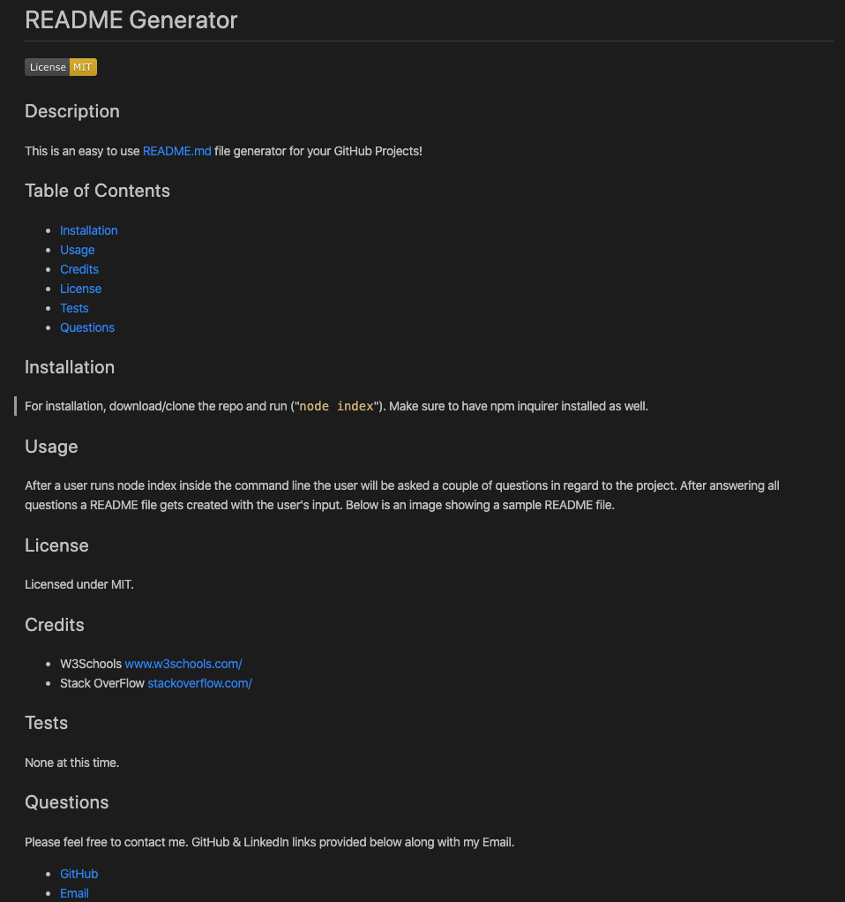

# README Generator
  
  ## Description
  This is an easy to use README.md file generator for your GitHub Projects!
  ## Table of Contents
  * [Installation](#installation)
  * [Usage](#usage)
  * [Credits](#credits)
  * [License](#license)
  * [Tests](#tests)
  * [Questions](#questions)
  ## Installation
  For installation, download/clone the repo and run ("`node index`"). Make sure to have npm inquirer installed as well.
  ## Usage
  After a user runs node index inside the command line the user will be asked a couple of questions in regard to the project. After answering all questions a README file gets created with the user's input. Below is an image showing a sample README file.
  
  ## Video
  Below is a link to a walkthrough video demonstrating the functionality of the README generator.
  * [Video](https://drive.google.com/file/d/1UTdJNw8Y4iu45aQKX1i9UlEfiv4AqKiI/view)
  ## License
  Licensed under MIT.
  ## Credits
  * W3Schools www.w3schools.com/  
  * Stack OverFlow www.stackoverflow.com/
  ## Tests
  None at this time.
  ## Questions
  Please feel free to contact me. GitHub & LinkedIn links provided below along with my Email.
  * [GitHub](github.com/saul10huerta)
  * [Email](saul10huerta@utexas.edu)
  * [LinkedIn](https://www.linkedin.com/in/saul10huerta/)
  